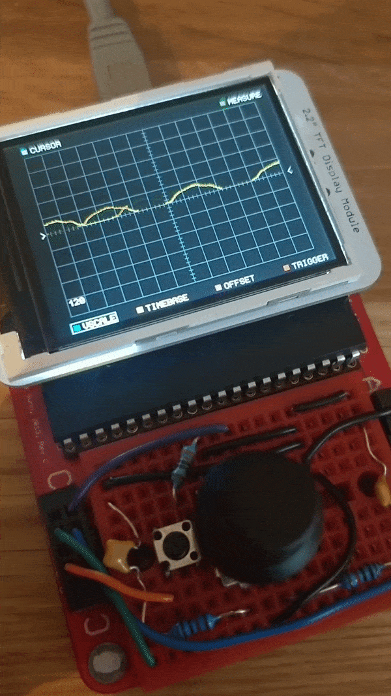

# avr-imos
🔌 Fully functional embedded Oscilloscope written in AVR C.

Running on an 'Il Matto' board which features an 8-bit ATmega644P running at 12MHz. Measurements taken with 8 channel 10-bit ADC, 15k samples per second, max read ~15V.
Display: DT022BTFT with ILI9341 controller chip.

 

## Features
Support for exporting/importing annotations in different formats:
- [X] Multiple cursor support - for both time and voltage axis
- [X] Ability to scroll through signal with minimap - also voltage scale and offset control.
- [X] Variable trigger modes - including free-running mode
- [X] Measurement of variables: Vmax, Vmin, Vpp, Vaverage and Vrms
- [ ] ML voltage anomaly detection via inference on an nRF52840
- [ ] Fast fourier transform (FFT) for signal analysis

## Registers
### ADC
REFSx = 0 : Select AREF as reference

ADLAR = 1 : Left shift result

MUXx  = 0 : Default to channel 0

ADTSx = 0 : Free running mode

ADATE = 1 : Enable auto trigger

ADIE  = 0 : ADC Interrupt Enable

ADPS2 = 1 : Configure ADC prescaler *  ADPS1 = 1 : F_ADC = F_CPU / 64 = 1.5MHz 

### Pins
DDRC = 0x00; // enable input

PORTC |= _BV(1) | _BV(2) | _BV(3) | _BV(6);

### Timer and Interrupts
PCICR = _BV(PCIE2);

PCMSK2 = _BV(1) | _BV(3) | _BV(6);

TIMSK0 |= _BV(TOIE0); // use overflow

TCCR0B |= _BV(CS00); // no prescaler
